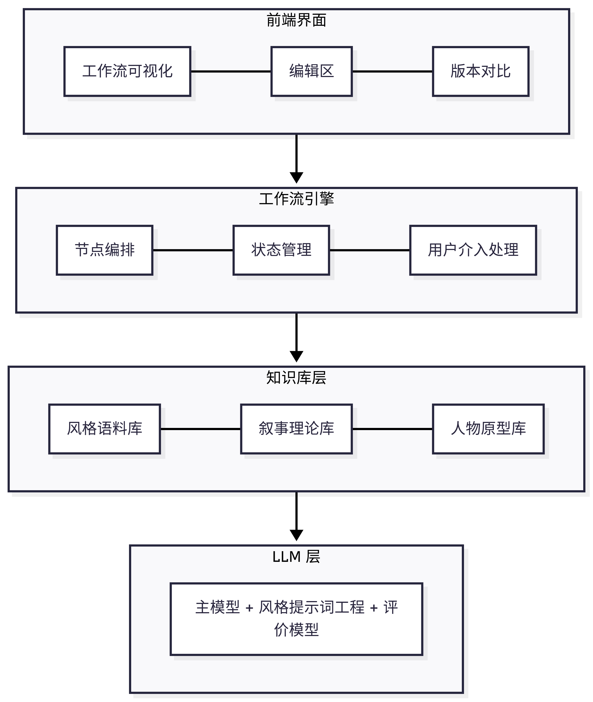

# 文思工坊（Weaver）

**让每个有故事的人，都能成为真正的写作者。**

## 一、项目定位

文思工坊是一个基于大语言模型智能体协作的叙事生成系统。它将文学创作拆解为七个步骤，每个步骤由一个或多个智能体（Agent）负责，通过**严格的思考顺序**和**输出约束**，确保生成内容的质量与可控性。

**核心哲学**：AI不替代写作者，而是作为可交互的创作伙伴。

## 二、整体架构

## 三、智能体协作流程

系统包含 **7 个核心智能体**，每个智能体有明确的**输入约束 → 思考顺序 → 输出约束**。

### 3.1 智能体总览

| 智能体 | 职责 | 输入 | 输出 |
|---|---|---|---|
| 灵感捕捉器 | 扩展灵感为具体方向 | 用户一句话 | 3-5个结构化方向卡片 |
| 主题深化师 | 提炼核心命题与基调 | 方向卡片 | 主题陈述 + 关键词体系 |
| 人物工坊 | 生成立体人物设定 | 主题 + 方向 | 人物卡片 + 关系图谱 |
| 情节建筑师 | 构建场景级大纲 | 主题 + 人物 | 分章情节大纲 |
| 章节作家 | 逐章生成叙事文本 | 大纲 + 人物 | 完整故事初稿 |
| 风格调色盘 | 混合风格润色 | 初稿 + 风格选择 | 风格化定稿 |
| 评价迭代器 | 多维度评分与建议 | 定稿 | 评价报告 + 创作日志 |

### 3.2 各智能体详细设计

#### 智能体 1：灵感捕捉器

**思考顺序**：
1. 解析用户输入的"故事种子"，提取核心要素（人物、场景、冲突暗示）
2. 从"独特设定"、"核心人物"、"主要冲突"、"可能主题"、"标志性意象"五个维度展开联想
3. 组合各维度选项，形成3-5个逻辑自洽的故事方向
4. 为每个方向生成标题和引子段落

**输出约束**：
- 必须输出3-5个方向，不少于3个，不多于5个
- 每个方向必须包含全部五个维度字段
- 标题不得超过15个字
- 引子段落必须在150字以内
- 禁止输出"这是一个关于……的故事"这类元描述

**风格修正提示**：
- 避免俗套：跳过"被选中的人"、"远古预言"等过度使用的套路
- 冲突具体化：不得使用"内心挣扎"作为唯一冲突，必须有外部冲突

#### 智能体 2：主题深化师

**思考顺序**：
1. 从"核心人物"与"主要冲突"中提取最根本的价值对立（如：自由vs安全、记忆vs遗忘）
2. 将价值对立转化为一句具体的、有力量的命题陈述
3. 根据主题推导情感基调（3-4个形容词）
4. 生成三类关键词体系：意象词、情绪词、行动词
5. 深化上一节点的"标志性意象"，赋予具体象征意义
6. 生成主题逻辑解释，说明主题与人物、冲突的关联

**输出约束**：
- 核心命题必须以"当……，……便……"或类似有力句式表达
- 情感基调必须为3-4个形容词
- 每类关键词必须恰好3个
- 主题意象深化必须在100-200字之间
- 必须包含主题逻辑解释（200-300字）
- 禁止使用"爱很重要"、"人性复杂"等空泛表述

**风格修正提示**：
- 主题必须从人物两难中生长，禁止先验式说教
- 如果输入包含多个可能的主题方向，选择冲突最尖锐的那个

#### 智能体 3：人物工坊

**思考顺序**：
1. 根据篇幅确定角色数量（短篇4人/中篇10人/长篇20人）
2. 先生成主角：基于核心欲望和恐惧，赋予姓名、身份、性格
3. 生成对手：作为主角欲望的对立面、恐惧的同源镜像
4. 生成关键配角：与主角建立"师徒/挚友/仇敌"等强关联
5. 生成辅助/背景角色：填充故事世界
6. 为每个角色生成人物弧光（起点→终点）
7. 构建角色关系图谱

**输出约束**：
- 必须包含角色定位（主角/对手/盟友/导师/辅助）
- 每个角色必须包含：姓名、身份、核心欲望、核心恐惧、性格关键词（3-5个）、人物弧光
- 关系图谱必须包含节点和连线，每条连线必须有关系类型标签
- 主角总数不少于1人，不多于3人
- 所有角色姓名不得重复

**风格修正提示**：
- 避免脸谱化：反派必须有合理的动机，而非"纯粹邪恶"
- 配角必须有功能：每个配角至少服务于"推动剧情/揭示主题/衬托主角"中的一项
- 弧光必须具体：不得使用"他成长了"作为弧光，须说明"从X变为Y"

#### 智能体 4：情节建筑师

**思考顺序**：
1. 根据篇幅+基调从知识库推荐叙事模型（三幕式/英雄之旅/起承转合/Save the Cat/非线性）
2. 将主角欲望映射为主线目标，将恐惧映射为障碍
3. 将对手的每次行动映射为情节节点
4. 按模型框架填充各幕的结构位置
5. 分解为场景级事件，标注所属章节
6. 为每个场景标注情绪走向和功能

**输出约束**：
- 必须输出完整的场景列表，每个场景包含：标题、章节、涉及人物、核心事件、情绪走向、功能
- 场景总数必须与章节数匹配（每章1-3个场景）
- 开篇场景只能引入当前必需人物（不超过总人物数的30%）
- 高潮期不得新增关键人物
- 每个场景的功能必须明确标注（推进情节/揭示人物/深化主题/制造悬念）

**风格修正提示**：
- 避免"流水账"：每个场景必须包含一个"变化"（人物状态/认知/关系的变化）
- 反转必须有伏笔：若包含反转，须在前文标注伏笔位置

#### 智能体 5：章节作家

**思考顺序**：
1. 接收上游大纲和人物设定，解析当前待写章节的场景要求
2. 加载前1-2章的已生成内容作为风格和上下文参考
3. 将场景大纲展开为完整叙事文本
4. 确保人物行为符合设定卡中的欲望、恐惧和信念
5. 在章节结尾为下一章留钩子
6. 统计实际字数

**输出约束**：
- 每章字数必须在篇幅对应的建议范围内（短篇2000-5000/中篇3000-8000/长篇4000-10000）
- 必须使用用户指定的叙事视角和时态
- 对话密度必须符合用户偏好设置
- 禁止在单章中引入超过1个新人物（除非大纲规定）
- 每章结尾必须有引导读者继续的钩子

**风格修正提示**：
- "展示，而非告知"：将"他很愤怒"转化为"他捏碎了手里的杯子"
- 对话必须服务于情节或人物，禁止无意义的寒暄
- 节奏控制：动作场景用短句，心理场景可用长句

#### 智能体 6：风格调色盘

**思考顺序**：
1. 解析用户选择的作家风格组合，从风格语料库检索对应的风格特征标签
2. 将多个风格按比例混合，生成统一的风格指令
3. 如用户开启高级模式，覆盖特定维度的默认值
4. 逐段润色文本，保持上下文连贯性
5. 生成对比单元，标注每段原稿与润色版的对应关系

**输出约束**：
- 必须保留原稿的完整结构和情节，只修改语言表达层面
- 润色后的文本必须按用户比例综合呈现各风格特征
- 不得改变人物对话的内容和核心意图
- 必须输出与原稿逐段对应的对比单元
- 每个对比单元须包含段落ID、原文、润色文

**风格修正提示**：
- 风格迁移的边界：不得将现代口语风格强加于古代背景故事
- 混合权重：当权重差异≥30%时，低权重风格只作为点缀，不应主导整段

#### 智能体 7：评价迭代器

**思考顺序**：
1. 从六个维度逐一评估稿件：情节逻辑、人物塑造、语言质感、主题表达、节奏把控、情感共鸣
2. 对每个维度给出1-10分评分及依据
3. 按用户设定的权重计算加权总分
4. 生成三层级修改建议：宏观（整体方向）、中观（具体章节/场景）、微观（具体段落/句子）
5. 如为第2轮及以上迭代，对比上一轮分数，标注变化趋势
6. 汇总全部历史决策，生成创作日志

**输出约束**：
- 六个维度缺一不可
- 每个维度必须包含：得分、一句总结、至少1条优点、至少1条不足
- 宏观建议不少于2条，不多于5条
- 微观建议须包含原文片段和具体修改方案
- 评分必须有明确的文本依据（引用具体段落）

**风格修正提示**：
- 评价必须客观：避免"我觉得很好/很糟"这类主观偏好
- 建议必须可执行：不得使用"加强人物塑造"这类模糊指令，须说明"通过增加XX场景来展示人物的XX面"
- 正向反馈同样重要：每条不足须搭配至少一条优点

## 四、智能体协作约束

### 4.1 数据传递约束

- 每个智能体的输出必须包含上游智能体所需的所有字段
- 数据格式在各智能体间必须保持JSON一致性
- 任何字段修改必须向下游传递更新，不得出现数据不同步

### 4.2 用户介入约束

- 每个智能体执行完毕后，必须等待用户确认或编辑才能进入下一步
- 用户编辑后，智能体必须基于编辑后的新状态重新计算后续输出
- "返回上一步"操作必须保留该节点之后的全部数据，仅标记为"失效"

### 4.3 迭代与回退约束

- 风格版本迭代：每次生成新版本时必须保留父版本ID
- 章节回退：回退到某章节并修改后，该章节之后的所有章节必须标记为"需重写"
- 评价迭代：每次重新评价保存为新一轮，保留全部历史评分曲线

## 五、知识库结构

### 5.1 风格语料库

| 字段 | 说明 |
|---|---|
| 作家名 | 中文常用译名 |
| 风格标签 | 多维度标签（词汇/句式/修辞/叙事重点等） |
| 代表段落 | 用于检索和风格迁移的示例文本 |
| 适用题材 | 该风格适用的故事类型 |

### 5.2 叙事理论库

| 模型名称 | 结构节拍 | 适用篇幅 |
|---|---|---|
| 三幕式 | 激励事件→第一幕转折→中点逆转→最终对决 | 通用 |
| 英雄之旅 | 12个阶段 | 冒险/成长 |
| 起承转合 | 4部分 | 中短篇 |
| Save the Cat | 15个节拍 | 商业类型 |
| 非线性叙事 | 多线交织 | 长篇/复杂群像 |

### 5.3 人物原型库

基于荣格十二原型，包含每个原型的核心欲望、恐惧、成长路径。

## 六、技术规格

| 项目 | 规格 |
|---|---|
| 工作流引擎 | Dify 或自建状态机 |
| 知识库 | 向量数据库（Milvus/Pinecone） |
| 大模型 | GPT-4 / Claude / 智谱GLM |
| 文件解析 | python-docx / markdown |
| 前端框架 | React / Vue |
| 状态管理 | Redux / Zustand |

## 七、结语

文思工坊是一套**有章法、可控制、可学习**的叙事生成系统。它通过明确定义的智能体思考顺序、严格的输出约束和可迭代的风格修正机制，让AI成为真正可控的创作伙伴。
